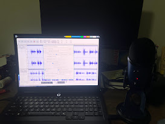

## Tending My Llamas: A Memoir

For this project I decided to record myself reading my grandfather's memoirs, which was ghostwritten by my grandmother.

Both of them passed away a few years ago, but she wrote both of their memoirs many years ago.

I've never taken the time to read either of them, so I'm going into this reading totally blind. This is my first readthrough of the memoir.

I plan to read my grandmother's memoir as well, and my create a similar project for that.

## Process
I created the web app using claude code with the glm-5.1 model hosted on ollama cloud.

The audio recording was done by me using audacity and a Blue Yeti USB microphone.

I originally planned to include images and commentary using this web app for timestamped content, but I decided to focus my efforts on the reading itself and the audio.

Although it was partially for time reasons, I also found it very different to just provide my commentary as I saw fit while reading. Either through my suprised exclamations, clarifications, or other quips. I had a good time reading, but my voice is also sore because I did most of it in one sitting.
